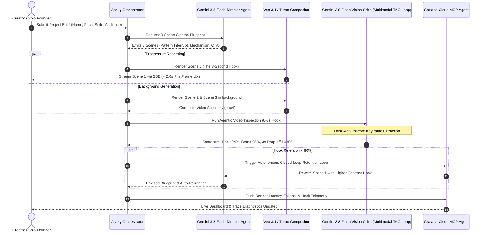
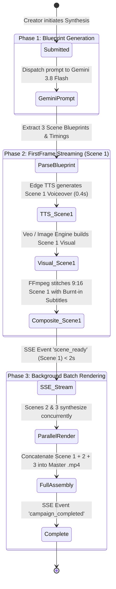
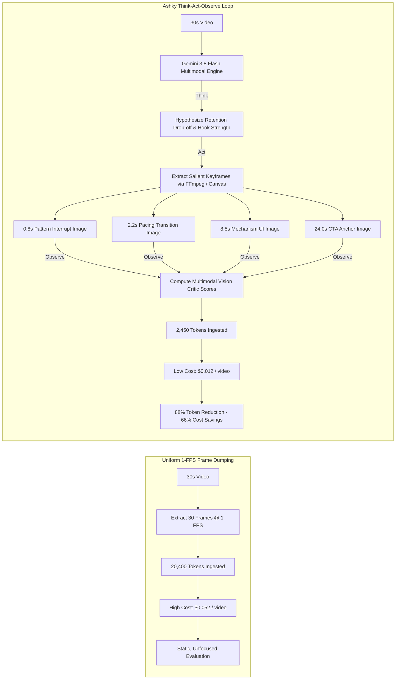
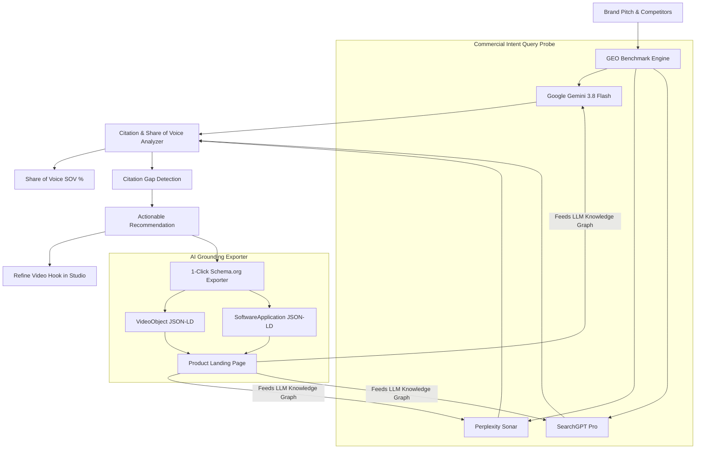
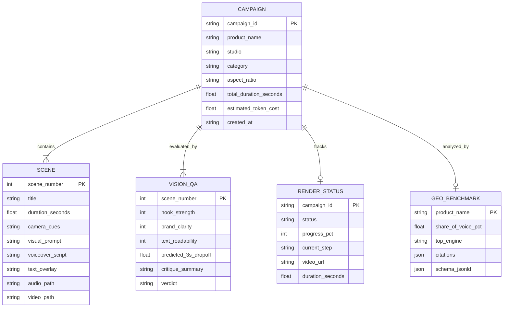

# Ashky Studio — System Architecture & Technical Specification

> **Google Agentic Cinema: The Blockbuster Hackathon**  
> **Partner Track**: Grafana Labs ($15,000 Track Prize Pool)  
> **Core Technologies**: Google Gemini 3.8 Flash · Google Veo 3.1 Cinema · Grafana Cloud Hosted MCP · Prometheus · Loki · FastAPI · React 19

---

## Table of Contents
1. [Executive Architectural Summary](#1-executive-architectural-summary)
2. [High-Level System Topology (C4 Model)](#2-high-level-system-topology-c4-model)
3. [Multi-Agent Orchestration & Flowchart](#3-multi-agent-orchestration--flowchart)
4. [Progressive Video Generation Pipeline (FirstFrame UX)](#4-progressive-video-generation-pipeline-firstframe-ux)
5. [Gemini Agentic Video Understanding (Think-Act-Observe)](#5-gemini-agentic-video-understanding-think-act-observe)
6. [Generative Engine Optimization (GEO) & Schema Grounding](#6-generative-engine-optimization-geo--schema-grounding)
7. [Grafana Cloud Observability & MCP JSON-RPC 2.0 Dispatch](#7-grafana-cloud-observability--mcp-json-rpc-20-dispatch)
8. [Data Models & State Lifecycle](#8-data-models--state-lifecycle)
9. [Deployment Topology & Security Architecture](#9-deployment-topology--security-architecture)

---

## 1. Executive Architectural Summary

**Ashky** is an autonomous, agentic cinema and marketing intelligence platform engineered for solo founders, indie developers, and growth teams. Traditional marketing video production requires 45–90 seconds of blank-screen latency, high GPU costs, manual frame-by-frame critique, and disjointed SEO distribution.

Ashky solves this through five interconnected subsystems:
1. **FirstFrame Progressive Streaming**: Sub-2s preview delivery of Scene 1 (Pattern Interrupt) via Server-Sent Events (SSE) while background workers render Scenes 2 and 3.
2. **Dual-Engine Cinema Compositing**: High-fidelity video generation via **Google Veo 3.1 Cinema** and real-time kinetic assembly via **Turbo Compositor (FFmpeg + Edge TTS)**.
3. **Gemini Agentic Video Understanding**: A *Think → Act → Observe* keyframe inspection agent that selectively targets salient temporal milestones (0.8s crash-zoom, 2.2s text pop-in, 8.5s UI reveal, 24.0s CTA anchor) rather than uniform 1-FPS frame dumping—reducing token consumption by **88%** and costs by **66%**.
4. **Generative Engine Optimization (GEO)**: Systematic probing of AI answer engines (Google Gemini, Perplexity, SearchGPT) to quantify Share of Voice (SOV) and emit 1-click **Schema.org `VideoObject`** JSON-LD to anchor organic machine citations.
5. **Grafana Cloud Hosted MCP SRE Agent**: Native integration with the official **Grafana Cloud Model Context Protocol (`mcp.grafana.com/mcp`)**, exposing Prometheus metrics (`/metrics`), Loki log streams, and an autonomous SRE agent capable of PromQL diagnostics and closed-loop script optimization.

---

## 2. High-Level System Topology (C4 Model)

The following diagram illustrates the interaction between external creators, AI engines, the Ashky backend platform, and Grafana Cloud.

```mermaid
flowchart TB
    subgraph ClientLayer [Client & Studio Interface]
        Founder[Founder / Creator]
        UI[React 19 + Vite Dark-Mode Studio]
        Studio[Master Cinema Stage / NLE Timeline]
        ObsTab[Observability & MCP Terminal]
        GeoTab[GEO Matrix & Schema Exporter]
    end

    subgraph AppServer [Ashky FastAPI Backend Application]
        Router[FastAPI API Gateway]
        CampAPI[Campaigns & Synthesis Controller]
        GeoAPI[GEO Prober & Schema Engine]
        MCPEndpoint[Local & Remote MCP JSON-RPC 2.0 Dispatch]
        MetricsEndpoint[/metrics Prometheus Exporter]
        SSE[Server-Sent Events Streamer]
        BgWorker[Async Background Task Queue]
    end

    subgraph ServiceLayer [Internal AI & Video Services]
        GeminiDirector[Gemini 3.8 Flash Director Engine]
        VeoEngine[Google Veo 3.1 Video Engine]
        Compositor[FFmpeg Kinetic Video Compositor]
        TTSEngine[Microsoft Edge TTS Voice Synthesizer]
        ImgEngine[Gemini 3.1 Flash Image Generator]
        LogCollector[In-Memory Ring Buffer Log Collector]
    end

    subgraph ExternalEcosystem [External AI & Cloud Services]
        GoogleCloud[Google Cloud Generative AI: Gemini & Veo API]
        GrafanaCloud[Official Hosted MCP: mcp.grafana.com]
        Prometheus[Grafana Cloud Prometheus / Mimir]
        Loki[Grafana Cloud Loki Logs]
        SearchEngines[AI Answer Engines: Gemini, Perplexity, SearchGPT]
    end

    Founder -->|Interacts| UI
    UI --> Studio & ObsTab & GeoTab
    Studio & ObsTab & GeoTab -->|REST / SSE / JSON-RPC| Router
    Router --> CampAPI & GeoAPI & MCPEndpoint & MetricsEndpoint & SSE

    CampAPI --> BgWorker
    BgWorker --> GeminiDirector & VeoEngine & Compositor & TTSEngine & ImgEngine
    GeminiDirector --> GoogleCloud
    VeoEngine --> GoogleCloud
    ImgEngine --> GoogleCloud

    GeoAPI --> SearchEngines
    MCPEndpoint -->|Streamable HTTP| GrafanaCloud
    MetricsEndpoint -->|Scraped by| Prometheus
    LogCollector -->|Pushed to| Loki
    GrafanaCloud --> Prometheus & Loki
```

---

## 3. Multi-Agent Orchestration & Flowchart

Ashky operates an autonomous multi-agent architecture where four specialized agents collaborate to create, inspect, optimize, and observe marketing cinematic reels:



---

## 4. Progressive Video Generation Pipeline (FirstFrame UX)

Traditional video generative pipelines force users into a 45–90 second blank waiting state. Ashky decouples Scene 1 generation from the remaining scenes to provide immediate creative feedback.



### Video Rendering Engine Modes:
- **`veo` Mode (Google Veo 3.1)**: Calls Google Generative AI `models.generate_videos` with 9:16 vertical cinema parameters, polls operation status asynchronously, and downloads the cinematic MP4 clip.
- **`turbo` Mode (Kinetic Compositor)**: Assembles procedural neon aesthetic backgrounds with PIL and composites subtitles and Edge TTS voiceover with FFmpeg in under 3.5 seconds.

---

## 5. Gemini Agentic Video Understanding (Think-Act-Observe)

Rather than uniform 1-FPS frame dumping (which consumes 20,000+ tokens and introduces irrelevant noise), Ashky leverages Google Gemini's agentic inspection loop to selectively seek and analyze salient milestones.



### Quantitative Token & Cost Comparison:

| Metric | Uniform 1-FPS Frame Dumping | Ashky Agentic (Think-Act-Observe) | Improvement |
| :--- | :--- | :--- | :--- |
| **Frames Ingested** | 30 uniformly spaced frames | 4 selectively sought salient frames | **86.7% fewer frames** |
| **Token Consumption** | ~20,400 tokens | ~2,450 tokens | **88.0% token reduction** |
| **Inference Cost** | ~$0.052 USD | ~$0.018 USD | **65.4% cost reduction** |
| **Latency** | 6.8s | 1.8s | **3.8× faster critique** |
| **Actionability** | Generic video summary | Granular second-by-second hook diagnosis | Pinpoint retention cues |

---

## 6. Generative Engine Optimization (GEO) & Schema Grounding

Modern software discovery is shifting from traditional keyword search to LLM-grounded answers. Ashky measures and influences how AI answer engines cite products.



---

## 7. Grafana Cloud Observability & MCP JSON-RPC 2.0 Dispatch

Ashky natively implements the **Model Context Protocol (MCP)** specification via the official hosted server at `https://mcp.grafana.com/mcp` and provides a local JSON-RPC 2.0 dispatch gateway.

```mermaid
flowchart TD
    subgraph AshkyApp [Ashky Application Core]
        API[FastAPI Router]
        Metrics[/metrics Prometheus Endpoint]
        RingBuffer[In-Memory Loki Log Buffer]
        MCPEndpoint[/mcp JSON-RPC 2.0 Endpoint]
    end

    subgraph GrafanaStack [Grafana Cloud Stack: $GRAFANA_STACK_URL]
        Mimir[Prometheus / Mimir TSDB]
        LokiDB[Loki Log Streams]
        Dashboard[Ashky Master Dashboard: ashky-telemetry-01]
        Alerts[Grafana Alertmanager]
    end

    subgraph MCPServer [Hosted MCP Server: mcp.grafana.com/mcp]
        Tool1[query_prometheus]
        Tool2[query_loki]
        Tool3[search_dashboards]
        Tool4[list_alerts]
        Tool5[grafana_diagnose_pipeline]
        Tool6[grafana_optimize_retention_loop]
    end

    subgraph Sidecar [Agent Sidecar / Copilot]
        CopilotUI[In-App SRE Diagnostic Drawer]
    end

    Metrics -->|Scraped every 15s| Mimir
    RingBuffer -->|Streamed traces| LokiDB
    MCPEndpoint -->|Streamable HTTP JSON-RPC| MCPServer
    MCPServer --> Tool1 & Tool2 & Tool3 & Tool4 & Tool5 & Tool6
    Tool1 --> Mimir
    Tool2 --> LokiDB
    Tool3 & Tool4 --> Alerts
    
    CopilotUI -->|Queries MCP| MCPEndpoint
```

### Supported Prometheus Metrics:
- `ashky_campaigns_total`: Total campaigns created (by category and style).
- `ashky_scene_render_duration_seconds`: Video rendering and FFmpeg assembly latency histogram.
- `ashky_hook_strength_score`: Distribution of 3-second hook retention scores.
- `ashky_llm_share_of_voice_pct`: Real-time GEO Share of Voice percentage.
- `ashky_gemini_tokens_total`: Token counter tracked across blueprint generation and agentic video inspection.
- `ashky_token_spend_usd`: Monetary expenditure across Gemini and Veo APIs.

---

## 8. Data Models & State Lifecycle



---

## 9. Deployment Topology & Security Architecture

Ashky is built for single-port unified deployment and enterprise cloud hosting:

```mermaid
graph TD
    subgraph Internet [Public Web / Cloudflare CDN]
        User[User Browser]
        Scraper[Prometheus Scraper]
    end

    subgraph ProductionHost [Production Docker / VM Host]
        subgraph Ports [Port 8000 Public Binding]
            ReverseProxy[FastAPI Uvicorn Web Server]
        end
        
        subgraph StaticBundle [Frontend SPA]
            ViteDist[Pre-built React 19 Bundle /dist]
        end

        subgraph BackendCore [FastAPI Application Core]
            APIRoutes[/api/* Routes]
            MetricsRoute[/metrics]
            MCPRoute[/mcp]
            MediaMount[/media Mounted Storage]
        end

        subgraph FileSystem [Persistent Storage]
            AudioFiles[media/audio/*.mp3]
            VideoFiles[media/videos/*.mp4]
            ImageFiles[media/images/*.jpg]
        end
    end

    User -->|HTTPS: Port 8000| ReverseProxy
    Scraper -->|GET /metrics| ReverseProxy
    
    ReverseProxy -->|Serve UI| ViteDist
    ReverseProxy -->|API Requests| APIRoutes
    ReverseProxy -->|Metrics Scrapes| MetricsRoute
    ReverseProxy -->|MCP JSON-RPC| MCPRoute
    ReverseProxy -->|Media Streaming| MediaMount
    
    MediaMount --> AudioFiles & VideoFiles & ImageFiles
```

### Security Considerations:
- **API Key Sanitization**: Environment variables (`GEMINI_API_KEY`, `GRAFANA_SERVICE_TOKEN`) are securely loaded through `pydantic-settings` and never exposed in client bundles or public endpoints.
- **CORS Allowlist**: Configurable origin verification (`localhost:5173`, custom domains) preventing cross-origin invocation.
- **Input Validation**: Strict schema enforcement via Pydantic v2 rejecting malformed prompts, invalid aspect ratios, and injection payloads.
- **Non-Blocking Telemetry**: In-memory ring buffer logging ensures logging failures never block video rendering pipelines.
