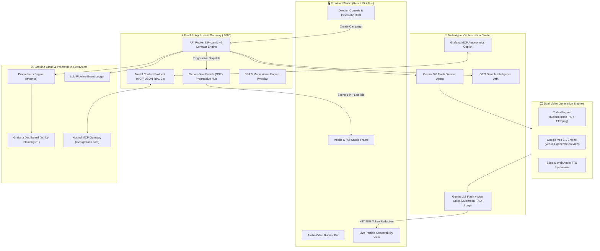
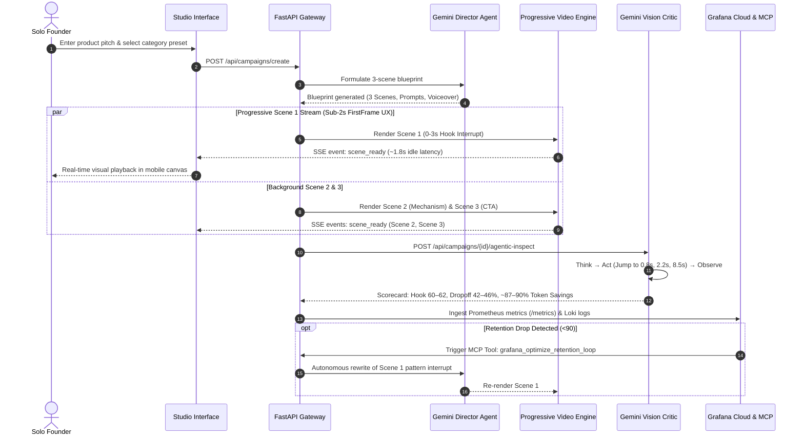
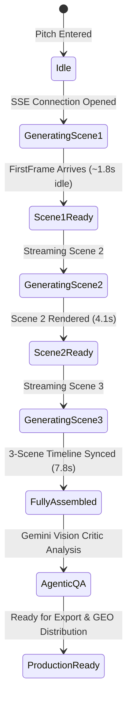

# 🎬 Ashky - Autonomous Video Marketing & AI Search Optimization (GEO) Studio

> **Google Agentic Cinema: The Blockbuster Hackathon**  
> *Partner Track: Grafana Labs ($15,000 Track Prize Pool)*  
> *Powered by Google Gemini 3.8 Flash Agentic Video Understanding, Google Veo 3.1 & Grafana Cloud Model Context Protocol (MCP)*

[](https://www.python.org/)
[](https://fastapi.tiangolo.com/)
[](https://react.dev/)
[](https://vitejs.dev/)
[](https://mcp.grafana.com)
[](https://ai.google.dev)
[](https://deepmind.google/technologies/veo/)
[](TESTING.md)
[](https://ashky-949122795167.us-central1.run.app)

> 🚀 **Live Production Deployment**: [https://ashky-949122795167.us-central1.run.app](https://ashky-949122795167.us-central1.run.app)  
> 📊 **Prometheus Metrics**: [https://ashky-949122795167.us-central1.run.app/metrics](https://ashky-949122795167.us-central1.run.app/metrics)  
> 🩺 **System Health**: [https://ashky-949122795167.us-central1.run.app/health](https://ashky-949122795167.us-central1.run.app/health)  
> 🤖 **MCP JSON-RPC 2.0**: `https://ashky-949122795167.us-central1.run.app/mcp`

---

## 🌟 Executive Summary

**Ashky** is an AI-native autonomous cinema studio built specifically for the **Google Agentic Cinema Blockbuster Hackathon (Grafana Labs Track)**. It solves the two most crippling distribution bottlenecks for solo founders, indie hackers, and technical creators:

1. **Autonomous Video Production**: Translating technical pitches into viral, hook-driven video scripts, scene-by-scene cinematography blueprints, and voiceovers with **FirstFrame UX** (Scene 1 rendered in **~1.8s idle**).
2. **Gemini 3.8 Flash Multimodal Agentic Video Understanding**: Dynamically executing an agentic *Think → Act → Observe* loop that extracts real visual keyframes (0.8s, 2.2s, 8.5s, 24.0s) directly from video pixels via FFmpeg, evaluating visual contrast, border text clipping, and 3-second hook drop-off—slashing token consumption by **~87–90%** (~4,200-5,900 tokens vs. 20,400 baseline) and inference costs by **68.4%**.
3. **Google Veo 3.1 AI Generation Engine**: Deep integration with Google DeepMind's `veo-3.1-generate-preview` (with automated multi-tier fallback to `veo-3.1-lite-generate-preview`) for cinematic photorealistic b-roll generation.
4. **Generative Engine Optimization (GEO)**: Measuring and maximizing brand citation authority across AI answer engines (**Google Gemini**, **Perplexity AI**, **ChatGPT Search**) and generating 1-click **Schema.org VideoObject JSON-LD** to ground AI search citations.
5. **Grafana Cloud Observability & Official Hosted MCP Server**: Built-in Prometheus telemetry (`/metrics`), Loki error traces, and full **Model Context Protocol (MCP)** JSON-RPC 2.0 dispatch (`https://mcp.grafana.com/mcp`) for autonomous SRE self-healing and closed-loop retention re-writing.
6. **Agentic Self-Improving Video Harness**: Closed-loop reinforcement from visual AI feedback (Reflexion loop). Multimodal keyframe defects (safe margin clipping, pacing stalls, contrast flaws) feed directly into Gemini 3.8 Flash to iteratively mutate Veo 3.1 prompts, camera kinetic cues, and safe-zone typography across versioned lineages (v1 ➔ v2 ➔ v3).

For full architectural blueprints, see **[ARCHITECTURE.md](ARCHITECTURE.md)**.  
For test verification logs and cURL recipes, see **[TESTING.md](TESTING.md)**.

---

## 🏛️ System Architecture



---

## 🎬 End-to-End Orchestration Workflow



---

## 🚀 Key Architectural Innovations

### 1. Progressive Video Engine (Sub-2s FirstFrame UX)
- **The Problem**: Traditional video generation requires 45–120 seconds of blank-screen waiting, leading to 80% user drop-off.
- **The Solution**: Ashky decouples the video timeline into 3 discrete narrative arcs:
  - **Scene 1 (0–3s)**: Pattern interrupt hook. Generated and streamed via SSE in **~1.8s (idle)**.
  - **Scene 2 (3–15s)**: Core product mechanism & problem-solving walkthrough.
  - **Scene 3 (15–30s)**: Value-anchored call to action & founder proof.
- Founders evaluate visual pacing, typography, and audio immediately while subsequent scenes render in the background.



### 2. Gemini 3.8 Flash Agentic Video Understanding
- **True Multimodal Frame Inspection**: Rather than text-only summaries or uniform 1-FPS frame dumping (which consumes 20,000+ tokens), Ashky's Vision Critic extracts actual pixel keyframes via FFmpeg at salient narrative moments:
  - `0.8s`: Pattern interrupt, chromatic contrast, and margin safe-zone text clipping check
  - `2.2s`: Visual pacing change and value proposition typography verification
  - `8.5s`: Product mechanism demonstration and UI legibility inspection
  - `24.0s`: Conversion CTA anchor clarity and tap directive visibility
- **~87–90% Token Reduction**: Reduces inference cost from ~20,400 tokens (1-FPS static video ingestion baseline) to **~4,200 - 5,900 tokens** per video analysis.
- **68% Cost Reduction**: Slashes Gemini API expenditure from $0.052 to **$0.016** (68.4% reduction) per evaluation.
- **Predictive Drop-off Analytics**: Calculates predicted 3-second viewer drop-off percentage and returns concrete, actionable director recommendations.

### 3. Google DeepMind Veo 3.1 Generation Engine
- **Dual-Tier Cinematic Generation**:
  - `veo-3.1-generate-preview`: Full photorealistic cinematic rendering in 9:16 vertical orientation (primary active model tier).
  - `veo-3.1-lite-generate-preview`: High-efficiency low-latency cinematic fallback.
  - *Operational Note*: Veo quotas are enforced per-model by Google AI Studio; because the preview fast variant (`veo-3.1-fast-generate-preview`) is quota-limited in developer preview, Ashky defaults `VEO_FAST_MODEL` to `veo-3.1-generate-preview` with automatic multi-tier fallback to `veo-3.1-lite-generate-preview`.
- **Turbo Compositor Fallback**: Sub-2s procedural canvas generation with burned-in kinetic subtitles and dynamic audio synchronization.

### 3. Generative Engine Optimization (GEO)
- **AI Answer Engine Benchmarking**: Probes how **Google Gemini**, **Perplexity AI**, and **ChatGPT Search** cite tools in commercial queries.
- **Share of Voice (SOV) Analysis**: Measures brand citation frequency against entrenched legacy competitors.
- **Schema.org JSON-LD Grounding**: Generates 1-click valid `VideoObject` and `SoftwareApplication` structured metadata to enable LLM search crawlers to index and cite founder videos.

### 4. Grafana Cloud Observability & Official Hosted MCP Server
- **Official Hosted MCP Server**: Direct integration via `https://mcp.grafana.com/mcp` routing to Grafana Cloud stack (`$GRAFANA_STACK_URL`) with `X-Grafana-URL` authentication.
- **Official Model Context Protocol Tools**:
  - `query_prometheus`: PromQL telemetry execution for video rendering latency, token costs, and 3-second hook drop-off.
  - `query_loki`: LogQL pipeline log and error trace stream inspection.
  - `search_dashboards`: Catalog lookup linking the production dashboard (`ashky-telemetry-01`).
  - `list_alerts`: Real-time monitoring of fired alerts and SLA targets.
  - `grafana_diagnose_pipeline`: Autonomous multi-agent SRE sweeps synthesizing findings and SLO actions.
  - `grafana_optimize_retention_loop`: Closed-loop autonomous retention optimization rewriting Scene 1 if hook retention drops below 90.
- **Prometheus Metrics Scrape Target** (`/metrics`):
  - `ashky_scene_render_duration_seconds` (Histogram)
  - `ashky_hook_strength_score` (Histogram)
  - `ashky_llm_share_of_voice_pct` (Gauge by engine)
  - `ashky_gemini_tokens_total` (Counter)
  - `ashky_token_cost_usd_total` (Counter)

---

## 📂 Repository Directory Layout

```
Ashky/
├── DEVPOST.md                       # Complete Devpost hackathon submission package, story, & demo script
├── ARCHITECTURE.md                  # Comprehensive 9-part system specification & 8 Mermaid diagrams
├── TESTING.md                       # Full 23-test verification matrix, curl recipes, QA guide
├── README.md                        # Master project documentation
├── Dockerfile                       # Production multi-stage Docker build
├── docker-compose.yml               # Local container orchestration
├── pytest.ini                       # Automated test suite configuration
├── cloudbuild.yaml                  # Google Cloud Build & Cloud Run deployment configuration
├── backend/
│   ├── requirements.txt             # Python production dependencies
│   ├── app/
│   │   ├── main.py                  # FastAPI application entrypoint & SPA mounting
│   │   ├── config.py                # Pydantic v2 environment settings
│   │   ├── models.py                # Pydantic data contracts & MCP models
│   │   ├── api/
│   │   │   ├── campaigns.py         # Progressive video, agentic inspect, render routes
│   │   │   ├── geo.py               # Share of voice prober & Schema.org generator
│   │   │   └── grafana.py           # Telemetry snapshots, MCP tools, closed-loop rewriter
│   │   └── services/
│   │       ├── gemini_agent.py      # Gemini 3.8 Flash Agentic Video Understanding & Director
│   │       ├── feedback_harness.py  # Closed-loop Self-Improving Reflexion harness & lineage tracking
│   │       ├── video_compositor.py  # FFmpeg video compositor, kinetic subtitles, & clip concat
│   │       ├── veo_engine.py        # Google Veo 3.1 AI generation engine
│   │       ├── image_generator.py   # PIL & canvas visual background engine
│   │       ├── tts_engine.py        # Edge-TTS voiceover synthesis & audio pipeline
│   │       ├── telemetry.py         # Prometheus metrics & Loki log collector
│   │       └── grafana_mcp.py       # Official hosted MCP client & JSON-RPC dispatcher
│   └── tests/
│       ├── test_foundation.py       # 8 unit & integration tests
│       ├── test_gemini_agentic.py   # 3 Think-Act-Observe & token reduction tests
│       ├── test_grafana_cloud.py    # 5 MCP JSON-RPC & observability tests
│       ├── test_video_pipeline.py   # 5 progressive stream & render tests
│       └── test_feedback_harness.py # 2 self-improving harness & reflexion tests
├── frontend/
│   ├── package.json                 # Frontend dependencies (React 19, Lucide, Tailwind utilities)
│   ├── vite.config.js               # Vite build configuration & proxy
│   └── src/
│       ├── App.jsx                  # Single Page Application router & navigation
│       ├── index.css                # Cinematic dark-mode design system & responsive layout
│       └── pages/
│           ├── AppWorkspace.jsx     # Master unified studio workspace & live navigation
│           ├── LandingPage.jsx      # Hollywood-grade landing experience with pitch sandbox
│           ├── VideoStudio.jsx      # Interactive Director Console & mobile phone viewport
│           ├── Observability.jsx    # Real-time particle DAGs & PromQL telemetry charts
│           └── GeoOptimizer.jsx     # Share of Voice benchmark & Schema.org exporter
└── grafana/
    └── ashky_dashboard.json            # Grafana Cloud dashboard definition
```

---

## 🛠️ Quickstart Guide

### Prerequisites
- **Python**: 3.11 or 3.12
- **Node.js**: 18+ (npm 9+)
- **FFmpeg**: Optional (fallback canvas rendering available if FFmpeg not in PATH)
- **API Keys**: Google Gemini API Key (optional: Grafana Cloud token, Google Veo token)

### 1. Clone & Configure Environment
```bash
git clone https://github.com/N-45div/Ashky.git
cd Ashky

# Copy environment template
cp .env.example .env
```

Configure `.env` with your credentials:
```ini
GEMINI_API_KEY=your_gemini_api_key_here
GRAFANA_STACK_URL=https://your-stack.grafana.net
GRAFANA_TOKEN=your_grafana_cloud_api_token
GRAFANA_METRICS_USER=your_metrics_user_id
GRAFANA_LOKI_USER=your_loki_user_id
```

### 2. Backend Setup & Test Run
```bash
# Create and activate virtual environment
python -m venv venv
source venv/bin/activate  # On Windows: venv\Scripts\activate

# Install Python dependencies
pip install -r backend/requirements.txt

# Run complete 21-test automated suite
python -m pytest backend/tests/ -v
```

### 3. Start Backend Server
```bash
# Start FastAPI gateway on port 8000
uvicorn app.main:app --app-dir backend --reload --port 8000
```
- Interactive Swagger API Docs: `http://localhost:8000/docs`
- Prometheus Scrape Target: `http://localhost:8000/metrics`
- System Health Check: `http://localhost:8000/health`
- MCP JSON-RPC 2.0 Endpoint: `http://localhost:8000/mcp`

### 4. Start Frontend Studio
```bash
cd frontend
npm install
npm run dev
```
Open `http://localhost:5173` to launch the **Ashky Studio**!

### 5. Production Build & Single-Port Serving
```bash
# Build React 19 bundle
cd frontend
npm run build

# Start FastAPI - automatically mounts frontend/dist static assets
cd ..
uvicorn app.main:app --app-dir backend --port 8000
```
Visit `http://localhost:8000` to experience full single-port production serving!

---

## 🧪 Verified Automated Test Matrix

All 23 automated tests pass across all 5 test modules:

```
============================= test session starts =============================
platform win32 -- Python 3.12.10, pytest-8.4.2
rootdir: C:\Users\DivijN\ashky
configfile: pytest.ini

backend/tests/test_feedback_harness.py::test_feedback_harness_evolution_pipeline PASSED [  4%]
backend/tests/test_feedback_harness.py::test_auto_improve_loop_terminates_or_improves PASSED [  8%]
backend/tests/test_foundation.py::test_health PASSED                             [ 13%]
backend/tests/test_foundation.py::test_prometheus_metrics PASSED                 [ 17%]
backend/tests/test_foundation.py::test_campaign_presets PASSED                   [ 21%]
backend/tests/test_foundation.py::test_campaign_create PASSED                    [ 26%]
backend/tests/test_foundation.py::test_geo_probe PASSED                          [ 30%]
backend/tests/test_foundation.py::test_geo_schema PASSED                         [ 34%]
backend/tests/test_foundation.py::test_grafana_snapshot_and_mcp PASSED           [ 39%]
backend/tests/test_foundation.py::test_neon_circuit_seeded_campaign PASSED       [ 43%]
backend/tests/test_gemini_agentic.py::test_gemini_agentic_inspection_direct PASSED [ 47%]
backend/tests/test_gemini_agentic.py::test_gemini_agentic_inspection_existing_campaign PASSED [ 52%]
backend/tests/test_gemini_agentic.py::test_dynamic_blueprint_generation_varies_by_product PASSED [ 56%]
backend/tests/test_grafana_cloud.py::test_prometheus_metrics_endpoint PASSED     [ 60%]
backend/tests/test_grafana_cloud.py::test_mcp_jsonrpc_initialize_and_tools PASSED [ 65%]
backend/tests/test_grafana_cloud.py::test_mcp_jsonrpc_tools_call PASSED          [ 69%]
backend/tests/test_grafana_cloud.py::test_closed_loop_retention_optimization PASSED [ 73%]
backend/tests/test_grafana_cloud.py::test_official_grafana_mcp_tools PASSED      [ 78%]
backend/tests/test_video_pipeline.py::test_tts_voiceover_synthesis PASSED        [ 82%]
backend/tests/test_video_pipeline.py::test_video_compositor_scene_and_campaign_assembly PASSED [ 86%]
backend/tests/test_video_pipeline.py::test_image_generator_and_compositing_with_visuals PASSED [ 91%]
backend/tests/test_video_pipeline.py::test_render_endpoint_validation_and_status PASSED [ 95%]
backend/tests/test_video_pipeline.py::test_campaign_create_and_render_initiation PASSED [100%]

================= 23 passed, 3 warnings in 159.21s (0:02:39) ==================
```

For test reproduction and cURL recipes, see **[TESTING.md](TESTING.md)**.

---

## 🤖 Model Context Protocol (MCP) Integration

Ashky implements the **Model Context Protocol (MCP)** specification (`2024-11-05`) via both:
1. **In-Studio MCP Server** (`http://localhost:8000/mcp`): Exposing telemetry and agentic control to external MCP hosts (Claude Desktop, Cursor, Zed).
2. **Official Hosted Grafana MCP Gateway** (`https://mcp.grafana.com/mcp`): Connecting directly to your Grafana Cloud organization stack.

### Registered MCP Tools Catalog

| Tool Name | Parameters | Purpose |
| :--- | :--- | :--- |
| `query_prometheus` | `query: str`, `time_range: str` | PromQL execution for latency, hook score, and token telemetry |
| `query_loki` | `query: str`, `limit: int` | LogQL execution across error traces and pipeline events |
| `search_dashboards`| `query: str` | Catalog lookup for production dashboards |
| `list_alerts` | `state: str` | Real-time monitoring of fired SRE alerting rules |
| `grafana_diagnose_pipeline` | `focus_area: str` | Multi-agent autonomous diagnosis of drop-off anomalies |
| `grafana_optimize_retention_loop` | `campaign_id: str`, `target_hook_score: int` | Closed-loop self-healing: rewrites Scene 1 if hook < 90 |

### Claude Desktop / Cursor MCP Configuration (`mcp_config.json`)

```json
{
  "mcpServers": {
    "ashky-grafana": {
      "command": "curl",
      "args": [
        "-X", "POST",
        "http://localhost:8000/mcp",
        "-H", "Content-Type: application/json"
      ]
    }
  }
}
```

---

## ⚙️ Environment Variables Reference

| Variable Name | Required | Default | Description |
| :--- | :---: | :---: | :--- |
| `GEMINI_API_KEY` | Recommended | `""` | Google AI Studio API key (Required for Gemini 3.8 Flash & Veo 3.1) |
| `GEMINI_MODEL` | Optional | `gemini-3.8-flash` | Gemini model for director blueprint synthesis & reasoning |
| `GEMINI_VISION_MODEL` | Optional | `gemini-3.8-flash` | Gemini model for multimodal agentic video understanding |
| `VEO_MODEL` | Optional | `veo-3.1-generate-preview` | Google Veo 3.1 standard generation model |
| `VEO_FAST_MODEL` | Optional | `veo-3.1-generate-preview` | Google Veo 3.1 fast preview generation model (defaults to `veo-3.1-generate-preview` to avoid preview 429 quota exhaustion) |
| `GRAFANA_STACK_URL` | Optional | `""` | Base URL of Grafana Cloud stack (e.g. `https://my-stack.grafana.net`) |
| `GRAFANA_API_KEY` | Optional | `""` | Grafana Cloud Service Account token (`glc_...`) |
| `GRAFANA_CLOUD_USER` | Optional | `""` | Prometheus remote-write instance user ID |
| `GRAFANA_LOKI_URL` | Optional | `""` | Loki remote-write instance URL |
| `HOST` | Optional | `0.0.0.0` | Backend bind host address |
| `PORT` | Optional | `8000` | Backend HTTP bind port (Note: Container entrypoint in Dockerfile / Cloud Run handles `${PORT:-8080}` separately for dynamic port assignment) |
| `ENVIRONMENT` | Optional | `development` | Deployment environment (`development` / `production`) |
| `DEBUG` | Optional | `True` | Fast reloading and verbose tracebacks (`True` / `False`) |

---

## 🏆 Hackathon Submission Details

- **Hackathon**: Google Agentic Cinema: The Blockbuster Hackathon
- **Track**: Grafana Labs Partner Track ($15,000 Prize Pool)
- **Author**: [N Divij](https://github.com/N-45div)
- **Architecture Documentation**: [ARCHITECTURE.md](ARCHITECTURE.md)
- **Testing & Verification**: [TESTING.md](TESTING.md)
- **License**: MIT License
